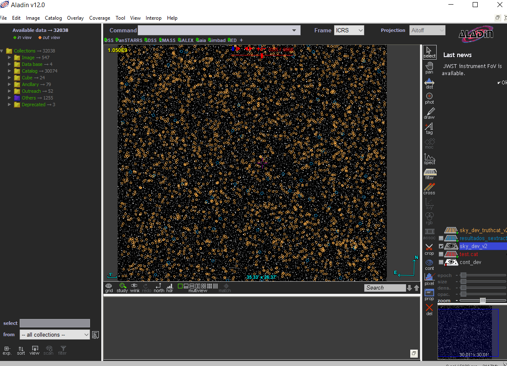
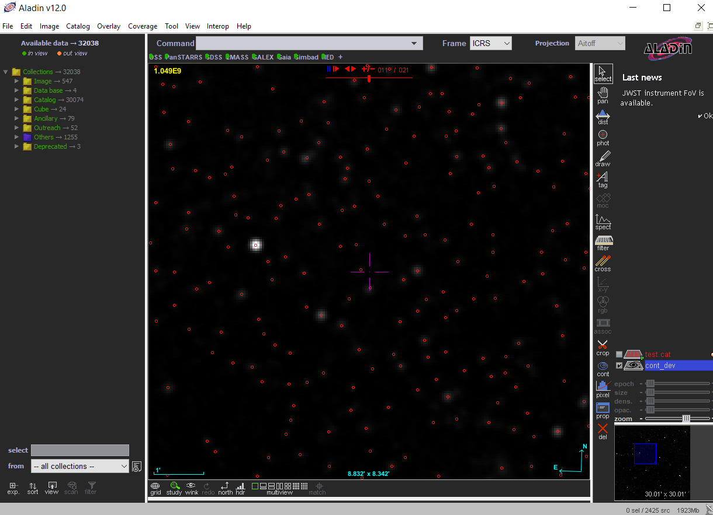

## Instalación

En Debian o Ubuntu, descargarse el archivo .deb de la [web oficial](https://www.astromatic.net/repositories/) e instalarlo con `sudo dpkg -i sextractor.deb`.

## Uso

Además del cubo, sextractor requiere cuatro archivos de configuración:

* `.sex`: configuración general
* `.param`: parámetros que van a aparecer en el catálogo de resultados. Ver [aquí](https://sextractor.readthedocs.io/en/latest/Param.html) la lista completa de parámetros que se pueden elegir
* `.nnw`: pesos de la red neuronal
* `.conv`: máscara de convolución

Los archivos `default.*` en esta carpeta tienen los valores por defecto.

Para ejecutar sextractor, poner estos archivos en la misma carpeta que el cubo y ejecutar `sex cubo.fits`.

## Resultados

En el **cubo grande del SDC2**: encuentra muy pocos resultados (en azul), que además en su mayoría no coinciden con la posición real de las galaxias en el catálogo (en amarillo).

En el **cubo pequeño del SDC2**: los resultados de sextractor parecen buenos a simple vista, pero no tenemos el catálogo real para comparar.

En el **cubo simulado**: encuentra sólo unas 30 de las 100 "galaxias", pero su posición es correcta.